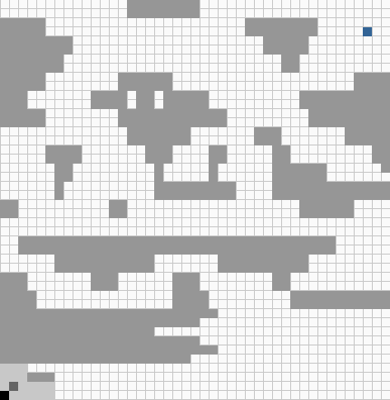
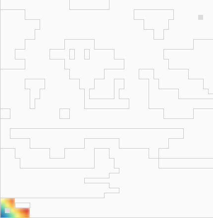

# Pathfinder
The Pathfinder consists of two main components: the maze and the bot.
The maze handles the environment, while the bot determines how to traverse the environment to reach its objective.
The Pathfinder runs 'rounds' in a loop where the maze provides the environment information to the bot in the form of a context which contains the blocks and the available positions. The bot then uses a combination of static and dynamic heuristic calculations to find its way to the desired location.

### Positional plot demo

### Static plot demo

### Dynamic plot demo


## Maze
The primary goal of the maze is to mimic what the sensors of the bot would be able to determine, which are the obstacles and the available positions within a given range.

The maze can either be made by creating an instance, and then adding or removing blocks from it using add_block and remove_block:
```
from src.maze import Maze
maze = Maze(30, 30) # X and Y dimensions
maze.add_block(10, 12) # X and Y coordinates
maze.add_block(11, 20)
```
Or the maze can be read from a text file of the format:
```
----------
------xx--
xxx----xxx
---xx---xx
x---x-----
```
Using:
```
maze = Maze.from_file('file/path.txt')
```
Then there are two main interfaces, the `get_surroundings`, and the `get_full_context`. They both return context objects. The first returns a context for the surroundings and blocks in a given range, while the latter returns all the positions and blocks.
```
context = maze.get_surroundings(position, view_range=5) # View range of 5 points radius
# or
context = maze.get_full_context()

surroundings = context.surroundings
blocks = context.blocks
```
The use of `get_surroundings` can be computationally intensive, so if the view_range is consistent between successive runs of the program, you can render the maze to a json file, and then read from that file instead. This allows all the calculations to be done in advance, making the program run quicker
```
maze.render_to_json(5) # Do the calculations for this given radius
# Once rendered you can load the maze from the rendered file
maze = Maze.from_json('path/to/json')
```

## Bot
The bot is given a destination and tries to reach the destination with a limited amount of information. It is a contextual object which gets provided information in the form a Context object each round.
* When a round is run using `bot.run_round(context)` the bot gets the new surroundings and the new blocks and adds them to its memory.
* If there is a waypoint (we'll get to this later) already calculated, we will move to the next position in the waypoint and end the turn
* Else we calculate dynamic heuristics of each position we haven't already targeted
* Then determine which one has the best (lowest) heuristic.
* If this position is adjacent, we move straight to it
* Else we use an A* algorithm to determine a path to that position, and set this path as the waypoint, moving to the first position in the waypoint at the end of the round

As the bot gains more information as a function of the rounds, it is a problem of optimising based on varying information. There are two parts to the optimisation, the calculation of the dynamic heuristic for each untravelled position, and the waypoint calculations.

The bot pathfinding can effectively be considered as a cumulation of smaller A* paths, where the target of each of these smaller paths is also determined in an A* manner based on heuristics.

### Heuristics
#### Static
Each known location has a static heuristic which is composed solely of the absolute distance to the destination.
#### Dynamic
Each round, the dynamic heuristic of each location is recomputed as this varies based on a number of factors. The root of the dynamic heuristic is the static heuristic plus the distance from the current position to the position we are calculating the heuristic for.
```
# Pseudo
static[x, y] = distance(to=destination, from=[x, y])
dynamic[x, y] = static[x, y] + distance(to=[x, y], from=current_position)
```
Then from this position, other conditions can be added to further optimise this heuristic.
